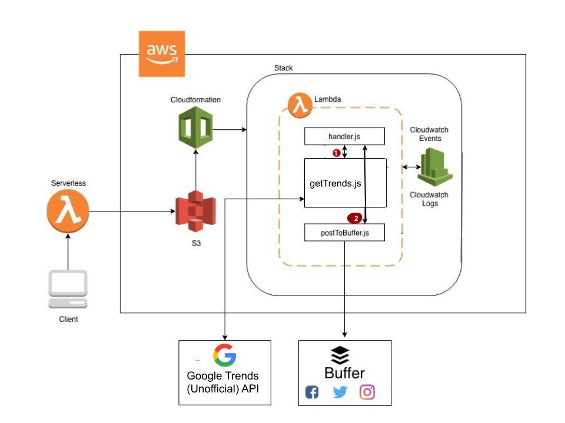

## techsurge-social

### description

This is a simple application made using [Serverless](https://www.serverless.com/) framework to get latest technology trends using (Unofficial) [Google Trends API](https://www.npmjs.com/package/google-trends-api) and publish to multiple social media sites using [Buffer](https://buffer.com/).

### architecture

### License Information
This code is open source!

Please review the LICENSE.md file for license information.
Distributed as-is; no warranty is given.
